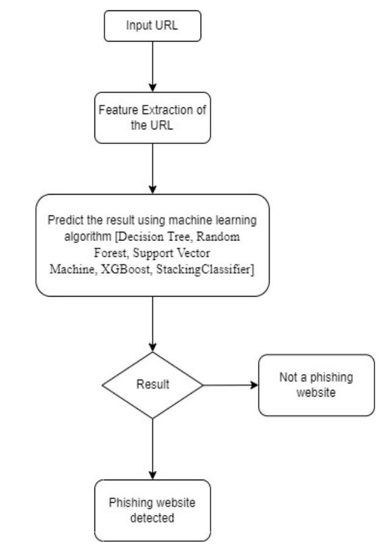
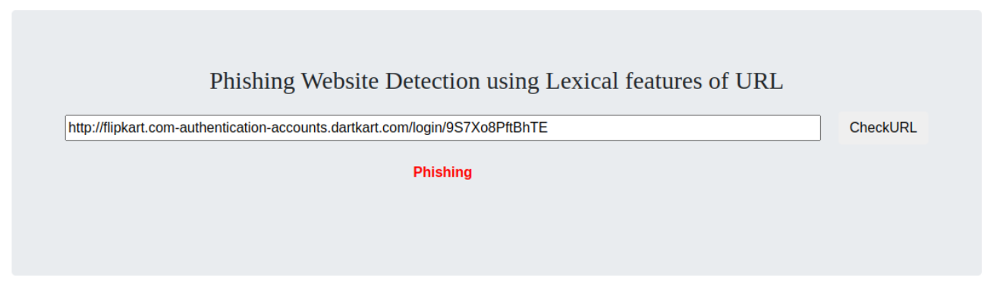
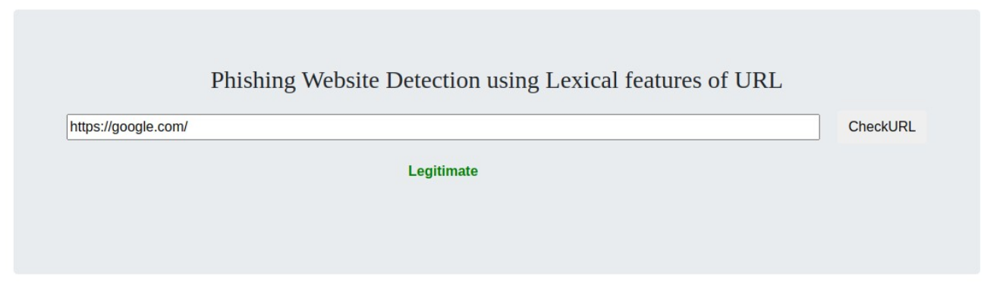

# :mag_right: Lexical Features Based Phishing URL Detection

## Objective
A phishing website is a common social engineering method that mimics trustful uniform resource locators (URLs) and webpages. The objective of this project is to train machine learning models and deep neural nets on the dataset created to predict phishing websites. Both phishing and benign URLs of websites are gathered to form a dataset and from them required URL and website content-based features are extracted. The performance level of each model is measures and compared.

## Data Collection
To perform phishing website classification, the Phishing Websites Data Set of the UCI machine learning repository is used. It contains 31 columns that have 30 features and a target variable which has the label. The target variable has
two classes denoting whether the website is legitimate or phishing. The dataset contains data of 11,055 legitimate and phishing 

* Link - https://drive.google.com/file/d/1fWv_tUD301Iex0Cx4T6_oQ2vE0nKY6TH/view?usp=sharing

## Feature Extraction
The features often used in phishing classification may be divided into two groups, as illustrated below.

* Lexical based features if URL
* Page based features

To locate URL-based characteristics, the feature extractor first analyses the website's URL. We retrieved the following URL-based characteristics.
* URL containing IP address
* URL length
* Shortening of URL
* URL having “@” symbol
* Redirecting using “//”
* Prefix/suffix
* Having subdomain in URL
* HTTPS (SSL)
* Domain registration length
* Favicon
* Port
* HTTPS token
* Request URL
* URL of anchor
* Links present in tags
* SFH
* Submitting to email
* Abnormal URL
* Redirection
* OnMouseOver event
* Right Click function
* Pop up window
* IFrame
* Domain Age
* DNS Record
* Traffic of Website
* Page Rank
* Google Index
* Links pointing to page
* Statistical Report

## Models & Training

Before stating the ML model training, the data is split into 80-20 i.e., 8844 training samples & 2211 testing samples. From the dataset, it is clear that this is a supervised machine learning task. There are two major types of supervised machine learning problems, called classification and regression.

This data set comes under classification problem, as the input URL is classified as phishing (-1) or legitimate (1). The supervised machine learning models (classification) considered to train the dataset in this project are:

* Decision Tree
* Random Forest
* XGBoost
* StackingClassifier
* Support Vector Machines

## Block Diagram

    

## Run
- Clone this Repository: `git clone https://github.com/TanayBhadula/phishing-website-detection.git`
- `cd phishing-website-detection/`
- `pip3 install -r requirements.txt`
- Now run, `python3 app.py`   
- Then you will see the below screen, enter the URl in search to find if its legitimate or phishing.
- 
## Implementation images

    

    

## End Results
From the obtained results of the above models, XGBoost Classifier has highest model performance of 97.4%, and Stacking Classifier gave 96% accuracy. 

### Next Steps

This project can be further extended to creation of browser extention or developed a GUI which takes the URL and predicts it's nature i.e., legitimate of phishing.  
